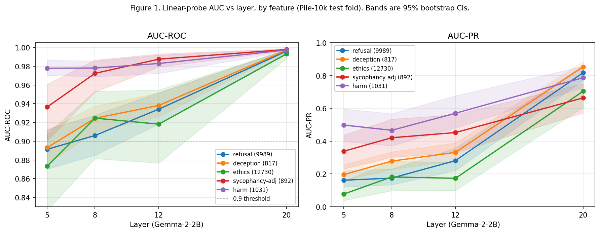
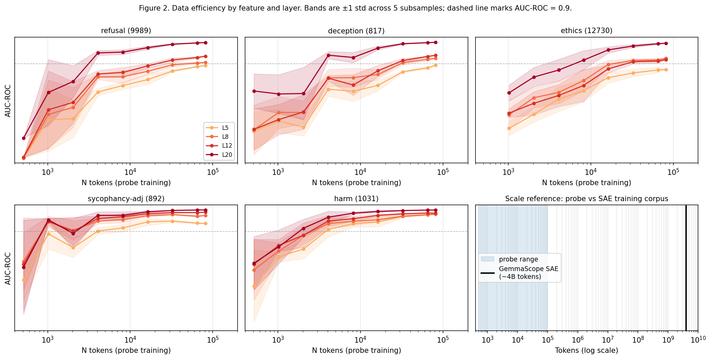
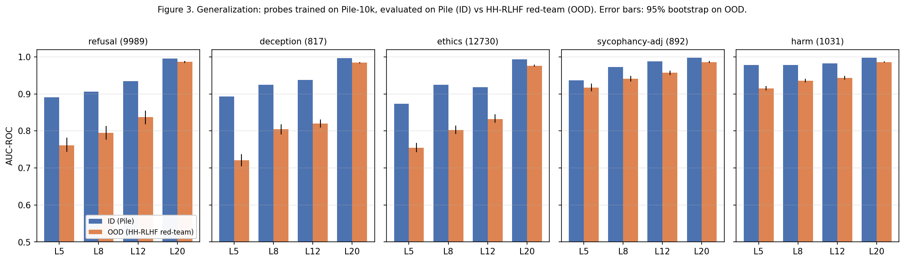

# Forecasting safety-relevant SAE features in Gemma-2-2B from residual stream activations

**Date:** 2026-05-23
**Compute envelope:** ~30 min Colab T4 (activation extraction) + ~1 hr local CPU (probes, sweeps, OOD eval).

## Abstract

Sparse autoencoders (SAEs) turn opaque residual streams into a vocabulary of interpretable features, but training a competitive SAE costs billions of tokens. We ask a narrower question: once the SAE has surfaced a feature you care about, can a small classifier on residual-stream activations reliably predict when that feature fires; and how much data does *that* take? Working with five safety-flavored features from GemmaScope's layer-20 residual SAE on Gemma-2-2B, we find: (i) linear probes hit AUC-ROC ≥ 0.87 in-distribution at every layer we tested, including layer 5; (ii) at the same layer the SAE was trained on (20), probes reach AUC-ROC ≥ 0.9 with **~1k-6k tokens** of supervised data, vs. ~4B tokens for the SAE; (iii) when we apply the same probes to a different distribution (Anthropic HH-RLHF red-team prompts), layer-20 transfer is near-perfect (gap ≤ 0.02) but early-layer transfer splits sharply by feature type; surface-form features whose firing aligns with specific words/tokens (harm, sycophancy-adj) generalize, while abstract features assembled across layers (refusal, deception, ethics) lose 0.10-0.17 AUC.

## 1. Introduction and motivation

> The opening worry: SAEs are expensive. GemmaScope's residual stream SAE for Gemma-2-2B was trained on roughly 4 billion tokens; beyond what's accessible to most outside teams. If you only need a handful of safety-relevant features and you already trust the SAE that defined them, do you really need to retrain the whole dictionary every time you want to deploy on a new context? Or is there a cheaper artifact; a probe; that does the same job for that subset?

The classic SAE pipeline produces a sparse dictionary `f(x) = ReLU(W_enc · x + b_enc)` over residual-stream activations `x` such that the original residual can be reconstructed from a small number of active features. Each component of `f` is a candidate interpretable feature, and the broader literature documents that many such features correspond to coherent semantic concepts (Cunningham et al. 2023; Bricken et al. 2023; Templeton et al. 2024).

For the alignment / safety use case, an attractive pattern is to (a) train one big SAE once, (b) identify the small subset of features that capture concepts you care about, then (c) for each of those features, train a *small probe* that can flag the feature's firing during inference or on offline data without invoking the SAE. The probe is cheap to train, cheap to run, and easy to audit.

This project quantifies (c) along three axes:

1. **Decodability:** how early in the network is the SAE-defined "fire / don't fire" decision linearly recoverable?
2. **Data efficiency:** how many labeled tokens does the probe need vs. the tokens the SAE used to surface the feature in the first place?
3. **Generalization:** does a probe trained on web text work on safety-flavored prompts without retraining?

We pick five layer-20 safety-flavored features from GemmaScope and answer all three for each.

## 2. Method

> What we built, in one paragraph: a thin pipeline that caches Gemma-2-2B residual streams on a small Pile slice, encodes them through the GemmaScope SAE to get binary labels, trains a logistic regression per (feature, layer) on those labels, then evaluates the probes against held-out web text and against an unseen safety distribution. Every step has a retrospective doc in `docs/0[2-6]_*.md`; this section is the compressed version.

**Model and SAE.** Base Gemma-2-2B (Gemma Team 2024; 26 layers, `d_model=2304`, bfloat16) and GemmaScope's residual-stream SAE at `layer_20/width_16k/canonical` (Lieberum et al. 2024), released as `gemma-scope-2b-pt-res-canonical` and loaded via the `sae_lens` library (Bloom et al. 2024). Activations are taken at the post-block residual stream, i.e. the output of `model.model.layers[L]` - the site GemmaScope residual SAEs were trained on.

**Target features.** Five features picked from Neuronpedia (Lin et al. 2023) by safety-keyword search, then verified by inspecting top-activating contexts. Final picks: `9989` (refusal), `817` (deception), `12730` (ethics), `892` (sycophancy-adjacent), `1031` (harm). Reported fire rates on the source corpus span 0.28%-0.76%. Full selection record in `docs/02_feature_selection.md`.

**Activation cache.** On Colab T4, we run Gemma-2-2B forward on 400 packed BOS-prefixed sequences of length 256 from `NeelNanda/pile-10k`, a 10,000-document sample of The Pile (Gao et al. 2020), yielding 102,400 tokens total. At layers `{5, 8, 12, 20}` we capture the residual stream via `register_forward_hook`; at layer 20 we additionally apply the SAE encoder, index out the five target features, and save the per-token JumpReLU (Rajamanoharan et al. 2024) activations as binary fire labels. The cache (~1.89 GB float16) is downloaded to the laptop for all downstream probe work.

**Splits.** A fixed 320 train / 80 test sequence-level split (seed 0) is shared across all probes. Splitting by sequence rather than by token avoids leaking adjacent-position information; BOS positions are masked from both folds. Net counts: 81,600 train tokens, 20,400 test tokens.

**Probe.** Per (feature, layer): scikit-learn (Pedregosa et al. 2011) `LogisticRegression` with `class_weight='balanced'` and `lbfgs`. Inputs are z-scored using statistics fit on the training fold. The L2 strength `C = 0.001` was chosen once on (feature 9989, layer 12) via 3-fold stratified CV across `C ∈ [1e-3, 1e-2, 1e-1, 1, 10]`, then reused for all probes; a 2-layer MLP sanity check was also run and consistently failed to beat the linear probe.

**Metrics.** AUC-ROC and AUC-PR with 200-resample stratified bootstrap 95% CIs (positives and negatives are resampled independently with replacement, preserving the test-fold base rate exactly in every resample).

**OOD eval.** Step 6 builds a second activation cache from Anthropic's HH-RLHF `red-team-attempts` subset (Ganguli et al. 2022; Bai et al. 2022), using only the human turns of each transcript (a defensive 3-pattern parser handles the dataset's transcript format). 100 BOS-prefixed sequences × 256 tokens = 25,600 tokens. The Step 4 probes are applied verbatim; including their Pile-fitted scaler statistics; to the safety residuals, and scored against the safety cache's SAE feature activations as OOD labels.

## 3. Results

> Three findings, in order of strength: in-distribution decodability is uncontroversial; data efficiency is striking but qualified; generalization is the most interesting result because it splits cleanly by feature type. We unpack each in turn.

### 3.1 In-distribution decodability (Figure 1)

**Linear probes hit AUC-ROC ≥ 0.87 at every layer for every feature.** The AUC-ROC panel shows monotonic improvement from layer 5 (0.87-0.98) to layer 20 (0.99-1.00). Layer 20 is essentially saturated; this is the same-layer upper bound; the SAE is by construction a linear function of layer-20 residuals followed by a JumpReLU threshold, so a logistic regression on layer-20 activations is recovering exactly that signal.

The AUC-PR panel (right) is more dispersed: PR values at layer 5 range from 0.08 (ethics) to 0.50 (harm), reflecting how much the probe's ranking concentrates true positives at the top of the score distribution. PR-AUC is the more diagnostic metric when positives are rare (the 0.4-1.4% base rate per feature here) and varies far more across features than AUC-ROC does.

Two observations matter for what follows:

- **Linear is enough.** A 2-layer MLP sanity check (not shown) ties or loses to the linear probe at every (feature, layer); the signal is well-modeled by a single linear projection followed by a threshold.
- **Feature kind matters.** Harm and sycophancy-adj are decodable at layer 5 (AUC-ROC 0.94-0.98) with PR-AUC 0.34-0.50, suggesting these features fire on specific surface-form tokens that the network already represents at shallow depth. Refusal, deception, and ethics climb more gradually with depth.

### 3.2 Data efficiency (Figure 2)

We swept the training set size from 510 tokens (2 sequences) to the full 81,600-token fold across 9 log-spaced points, with 5 random subsamples per N for variance. For each (feature, layer, N) we recorded the AUC-ROC at the (fixed) test fold. **The smallest N at which the mean AUC-ROC crosses 0.9:**

| feature | best layer | N_probe (tokens) | M_SAE / N_probe |
|---|---|---|---|
| 9989 refusal | L20 | 3,139 | ~1.3M× |
| 817 deception | L20 | 3,498 | ~1.1M× |
| 12730 ethics | L20 | 6,356 | ~630k× |
| 892 sycophancy-adj | L8 / L20 | ~860 | ~4.6M× |
| 1031 harm | L20 | 1,812 | ~2.2M× |

The 6th panel in Figure 2 shows the ratio visually: the entire probe-training range (light blue band) is several orders of magnitude smaller than GemmaScope's ~4B-token SAE training corpus (black line). For the easier features, the probe needs about **one millionth** of the SAE's data to reach AUC-ROC = 0.9.

**Two caveats on the ratio:**

1. The SAE and the probe solve different problems. The SAE jointly surfaces a 16,000-feature dictionary from unsupervised reconstruction; the probe is a labeled binary classifier for a feature that already exists in that dictionary. The right framing is: once the SAE has done the work of identifying the feature, predicting that feature's firing requires almost no additional supervised data.
2. The labels come from the SAE itself. We're not learning the feature from scratch; we're amortizing the SAE's labeling cost into a cheap inference-time predictor.

A secondary observation from Figure 2: the data-efficiency story varies by feature in line with §3.1. Harm and sycophancy-adj sit close to their saturated AUC even at the smallest N; refusal, deception, and ethics climb steeply with N at the early layers, and only saturate at layer 20.

### 3.3 Generalization to safety prompts (Figure 3)

For each (feature, layer), we apply the full-fold Pile-trained probe; **including its saved Pile-fitted scaler**; to the safety cache and report OOD AUC-ROC alongside the Step 4 ID baseline. Figure 3 shows the two as paired bars.

**The headline:** layer-20 probes generalize cleanly. Across all five features the OOD AUC-ROC stays above 0.976 with a gap to ID of at most 0.017. The same probe ships to red-team data without retraining or recalibration.

**The more interesting finding sits in the early layers:**

| feature kind | example | ID L5 AUC-ROC | OOD L5 AUC-ROC | gap |
|---|---|---|---|---|
| Surface-form (specific words/tokens) | harm, sycophancy-adj | 0.94-0.98 | 0.92 | 0.02-0.06 |
| Abstract (assembled across layers) | refusal, deception, ethics | 0.87-0.89 | 0.72-0.76 | 0.12-0.17 |

For surface-form features, the early-layer signal is robust; what the probe learned on Pile transfers to red-team prompts. For abstract features, **the early-layer ID signal is partly Pile-specific.** The probe scored 0.87-0.89 ID because the layer-5 residuals contain some directions that happen to correlate with the SAE's "this token is in a refusal context" judgment on web text. Those directions are less informative on safety prompts; the probe still scores above random (0.72-0.76 vs 0.50), but most of its early-layer punch was distribution-specific.

The gap closes monotonically with depth. By layer 12 the abstract-feature gap is down to 0.09-0.12; by layer 20 it's near zero.

A separate finding worth flagging is the **shift in fire rates** between distributions:

| feature | Pile-10k | HH-RLHF red-team | ratio |
|---|---|---|---|
| refusal (9989) | 1.01% | 2.33% | 2.3× |
| deception (817) | 1.39% | 4.78% | 3.4× |
| ethics (12730) | 0.57% | 4.96% | 8.7× |
| sycophancy-adj (892) | 0.81% | 3.41% | 4.2× |
| harm (1031) | 0.64% | 6.20% | 9.7× |

Safety prompts trigger these features 2-10× more often than web text. AUC-ROC is base-rate-invariant, so the cross-distribution AUC comparison remains honest; AUC-PR is *not* base-rate-invariant and looks (misleadingly) "better" OOD for several features.

## 4. Discussion and limitations

> What this means and doesn't mean. The framing we'd defend is narrow but real: for already-surfaced SAE features, you can train a thin, deployable predictor for a tiny fraction of the SAE's training cost, and at the SAE's own layer that predictor will transfer across distributions. We resist generalizing further than that; five features, one base model, one OOD corpus, one SAE family.

**What's load-bearing:**

- *Linear probing is enough at every layer we tested.* This matches a broad pattern in the interpretability literature (Alain & Bengio 2016; Belinkov 2022) and is what allows the M_SAE / N_probe ratio to be so extreme.
- *Layer-20 probes are essentially distribution-invariant for these five features.* This is a positive result for the deployment use case; a labeled-once predictor that works on new data without recalibration.
- *Early-layer "precursor" probes are partly distribution-specific for abstract features.* This is the most interesting scientific finding because it doesn't follow trivially from the others. It suggests that the early-layer linear directions an SAE-supervised probe latches onto are not the same as the directions that *cause* the layer-20 firing; they are *Pile-correlated* with it.

**Limitations to weigh against the above:**

1. **Five features, three of them clean and two semi-clean.** Sycophancy-adj is the closest available analogue of sycophancy in this base model (GemmaScope's IT variant would be more direct); harm has mild polysemy with an Arabic token. Conclusions about "abstract vs surface-form" generalization patterns rest on n=3 abstract and n=2 surface-form features; suggestive, not definitive.
2. **Base model, not instruction-tuned.** Several of these features (refusal in particular) would behave differently on Gemma-2-2B-it; we didn't test there.
3. **Single OOD corpus.** HH-RLHF red-team is one distribution shift. AdvBench-style adversarial prompts, model-generated text, or in-the-wild deployment data may show different patterns.
4. **Token-level positives only.** We predict "does this token fire?" rather than "will the next 50 tokens be a refusal?"; a more practically interesting "lookahead" framing would need a different label.
5. **Probe is L2-logistic.** Nonlinear probes (MLP) didn't help at full N; we did not check whether they help at small N (where the probe is regularization-dominated). Likely no, but not tested.
6. **M_SAE / N_probe is a token-budget headline, not an equal-task efficiency claim.** Re-stated: the SAE solves an unsupervised dictionary-learning problem; the probe is supervised binary classification. The ratio answers "how cheap is the labeled-predictor add-on once you have the SAE," not "is the SAE wasteful."

**One thing we didn't do but probably should:** mix Pile and HH-RLHF training data and re-run Step 5, to see whether the early-layer OOD gap for abstract features closes when the probe sees some safety-style tokens during training. We expect it would; we did not verify.

## 5. Reproducibility

All artifacts live in this repository. Each step has a retrospective doc that captures both the design and the empirical outcome:

| Step | Doc | Code |
|---|---|---|
| Smoke test | (none; `notebooks/01_smoke_test.ipynb`) | Colab |
| Feature selection | `docs/02_feature_selection.md` | `scripts/step2_neuronpedia_search.py` |
| Activation cache | `docs/03_activation_cache.md` | `notebooks/02_activation_cache.ipynb`, `scripts/check_activation_cache.py` |
| Probe training | `docs/04_probes.md` | `src/{data,eval,probe}.py`, `scripts/step4_train_probes.py` |
| Data efficiency | `docs/05_data_efficiency.md` | `src/data_efficiency.py`, `scripts/step5_{efficiency,analysis}.py` |
| Generalization | `docs/06_generalization.md` | `notebooks/03_safety_cache.ipynb`, `scripts/{check_safety_cache,step6_ood_eval}.py` |
| Write-up | this file | `scripts/step7_make_figures.py` |

Numerical results are in `results/step{4,5,6}_*.csv` with row-level granularity (per probe, per N-subsample, per OOD probe). All splits use seed 0; all probes use `C=0.001`, the value picked by Step 4's CV.

**Compute envelope.** Two Colab T4 sessions (~5 min and ~1.5 min for the two activation extractions) and ~1 hour of local CPU time on an 8 GB RAM Windows laptop (~27 min Step 4 + ~27 min Step 5 + ~2 min Step 6 + a few minutes for figure generation). Everything is reproducible end-to-end from the README's "Getting started" section.

## References

### Models, SAEs, and methods

Alain, G., & Bengio, Y. (2016). Understanding intermediate layers using linear classifier probes. *arXiv preprint arXiv:1610.01644*.

Belinkov, Y. (2022). Probing classifiers: Promises, shortcomings, and advances. *Computational Linguistics*, 48(1), 207-219.

Bricken, T., Templeton, A., Batson, J., Chen, B., Jermyn, A., Conerly, T., ... & Olah, C. (2023). Towards monosemanticity: Decomposing language models with dictionary learning. *Transformer Circuits Thread*, Anthropic. https://transformer-circuits.pub/2023/monosemantic-features

Cunningham, H., Ewart, A., Riggs, L., Huben, R., & Sharkey, L. (2023). Sparse autoencoders find highly interpretable features in language models. *arXiv preprint arXiv:2309.08600*.

Gemma Team. (2024). Gemma 2: Improving open language models at a practical size. *arXiv preprint arXiv:2408.00118*.

Lieberum, T., Rajamanoharan, S., Conmy, A., Smith, L., Sonnerat, N., Varma, V., Kramár, J., Dragan, A., Shah, R., & Nanda, N. (2024). Gemma Scope: Open sparse autoencoders everywhere all at once on Gemma 2. *arXiv preprint arXiv:2408.05147*.

Pedregosa, F., Varoquaux, G., Gramfort, A., Michel, V., Thirion, B., Grisel, O., ... & Duchesnay, E. (2011). Scikit-learn: Machine learning in Python. *Journal of Machine Learning Research*, 12, 2825-2830.

Rajamanoharan, S., Lieberum, T., Sonnerat, N., Conmy, A., Varma, V., Kramár, J., & Nanda, N. (2024). Jumping ahead: Improving reconstruction fidelity with JumpReLU sparse autoencoders. *arXiv preprint arXiv:2407.14435*.

Templeton, A., Conerly, T., Marcus, J., Lindsey, J., Bricken, T., Chen, B., ... & Henighan, T. (2024). Scaling monosemanticity: Extracting interpretable features from Claude 3 Sonnet. *Transformer Circuits Thread*, Anthropic. https://transformer-circuits.pub/2024/scaling-monosemanticity

### Datasets

Bai, Y., Jones, A., Ndousse, K., Askell, A., Chen, A., DasSarma, N., ... & Kaplan, J. (2022). Training a helpful and harmless assistant with reinforcement learning from human feedback. *arXiv preprint arXiv:2204.05862*. (HH-RLHF base dataset.)

Ganguli, D., Lovitt, L., Kernion, J., Askell, A., Bai, Y., Kadavath, S., ... & Clark, J. (2022). Red teaming language models to reduce harms: Methods, scaling behaviors, and lessons learned. *arXiv preprint arXiv:2209.07858*. (`Anthropic/hh-rlhf` `red-team-attempts` subset.)

Gao, L., Biderman, S., Black, S., Golding, L., Hoppe, T., Foster, C., ... & Leahy, C. (2020). The Pile: An 800GB dataset of diverse text for language modeling. *arXiv preprint arXiv:2101.00027*.

NeelNanda. (2023). pile-10k: A 10,000-document sample of The Pile. *HuggingFace dataset*. https://huggingface.co/datasets/NeelNanda/pile-10k

### Software and tooling

Bloom, J., Tigges, C., Chanin, D., et al. (2024). SAELens: A library for training, analyzing, and using sparse autoencoders on language models. https://github.com/jbloomAus/SAELens

Lin, J., Bloom, J., et al. (2023). Neuronpedia: A platform for mechanistic interpretability research on language models. https://www.neuronpedia.org/

---

*This writeup is the surface of a six-step working log. For the design decisions and empirical detail behind each number, follow the per-step retrospective links above.*
